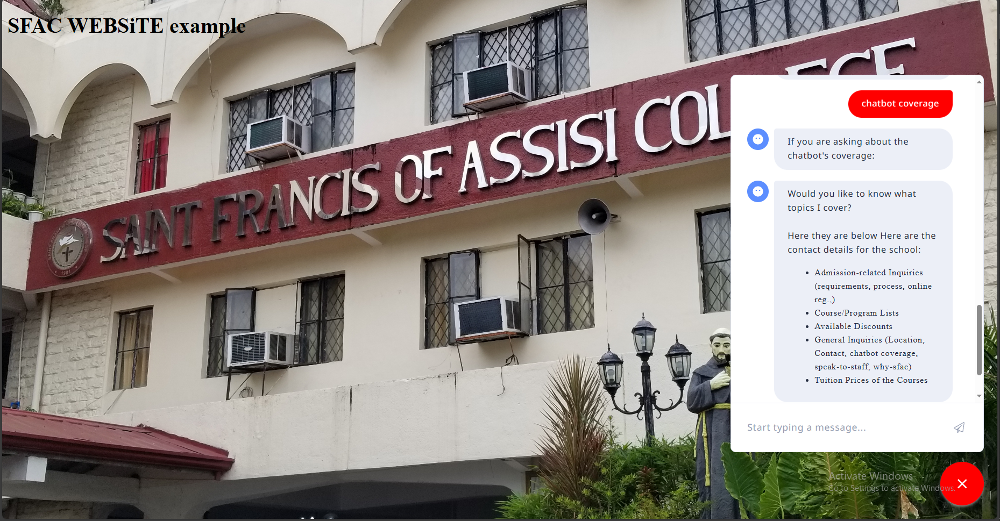
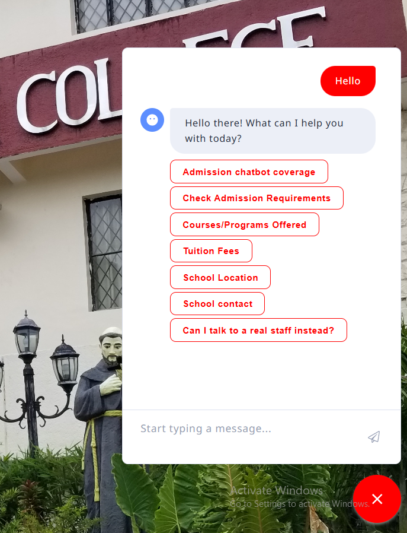
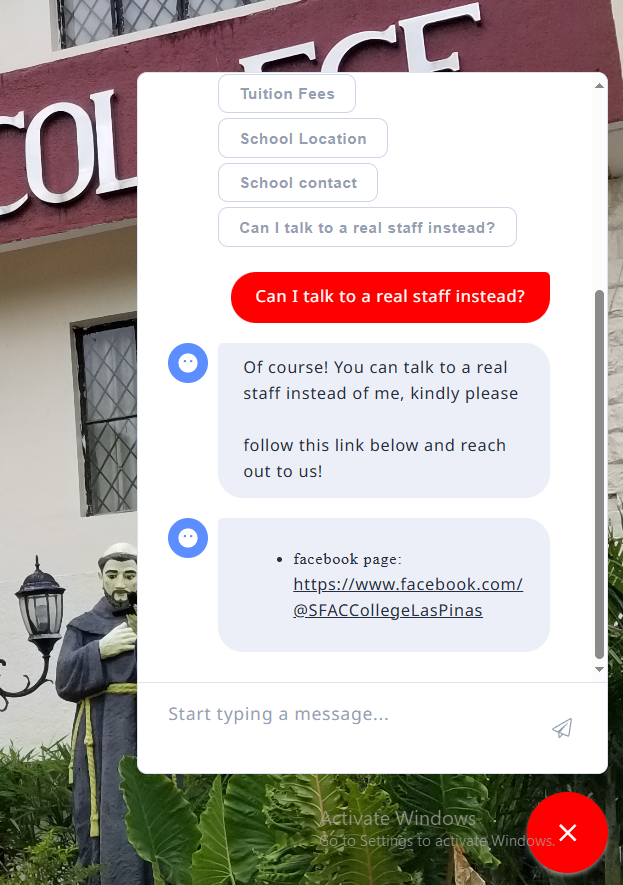
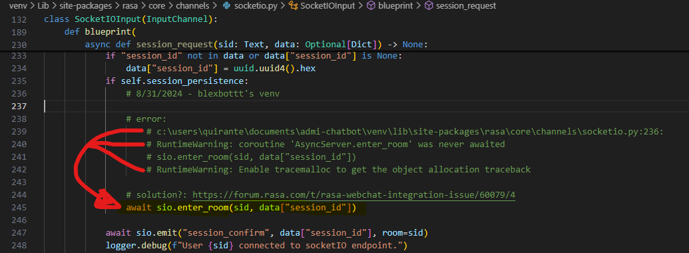
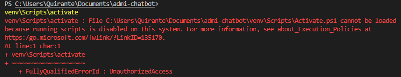

# SFAC-LP Admission chatbot

A text-based chatbot built with the **Rasa framework** in Python.  

**Objective**: The chatbot aims to handle **college-related admission inquiries** and answer them correctly.

# Images of the chatbot
|   Image   |   Description |
|-|-|
|       |Appearance of the widget|
|     |Welcome greeting of the chatbot with multiple button options for which topic|
|      |A sample topic response from chatbot where uttering to speak to a real staff instead|
|      |Button which can collapse the chatbot widget|

## Development Phase
- **Start Date**: 15th of June 2024
- **End Date**: 30th of November 2024

## Configurations
The project is developed using the following setup below:

- **Operating System**: Windows 10 Professional
- **Python Version**: 3.10.11
- **Pip Version**: 24.2
- **Rasa Version**: 3.6.20
---

## Checklist
| Task | Status |
|-------------------------|-------------------------------|
| Connect to the actual **LIVE** website    | **UNABLE**, due to new revision of in SFAC-LP's portal during late-development timeframe|
| Connect to **local** website              | **DONE** via Rasa widget chat `<div>` integration |
| MongoDB as the knowledge base             | **DONE**, via `rasa run actions` and action.py command tailored to fetch proper responses depending on the inquiry detected by the chatbot|
| ~~BERT Integration~~                      | **TECHNICALLY DONE, BUT** the results were nearly identical to results without BERT integration|
| ~~LLM Integration via OpenAI~~            | **UNABLE**, blocked due to paywalls for Rasa Pro and OpenAI APIs)                            |


### Dataset Tailored with:
- Focused with only **College-Related** questions within the admission office's scope

## Frequently Used Rasa CLI Commands (must activate venv first)

|**Command**|**Description**|
|   ----    |  ----    |
| `.venv\Scripts\activate`                            | Activates the virtual environment where the Rasa framework is stored, allowing exclusive execution of Rasa commands. |
| `rasa run actions`                                  | Connects Rasa's `action.py` code to MongoDB. **Run this first**, as chatbot responses rely on the database.|
| `rasa data validate`                                | Validates data to check for issues in the dataset, stories, rules, etc.|
| `rasa data split nlu --training-fraction 0.7`       | Splits NLU training data into training and test sets, defaulting to 80/20 but adjustable to 70/30 with the fraction.|
| `rasa train`                                        | Trains the model after ensuring no validation errors or issues exist.|
| `rasa shell`                                        | Talks to the chatbot in the Command Line Interface (CLI).|
| `rasa run --enable-api --cors "*"`                  | Default command for conversing with the chatbot through the web chat widget.|
| `rasa run --enable-api --cors "*" --model <path>`   | Runs a specific model if multiple `.tar.gz` models are saved.|


## Installation Problems

### 1. First-Time Installation Errors
If you encounter any of the following errors during the first-time installation:
- `subprocess-exited-with-error`
- `metadata-generation-failed`
- `mattermostwrapper` issue

Run these commands to resolve the issues:
```bash
pip install setuptools==58.0.4
pip install mattermostwrapper==2.2
pip install rasa
rasa --version
```
### 2. AsyncServer Warning

Error Location:

`c:\users\USER\cbproject\rasa-env\lib\site-packages\rasa\core\channels\socketio.py:236`

Error Message:

`RuntimeWarning: coroutine ‘AsyncServer.enter_room’ was never awaited`

**Solution:**
Refer to the screenshot below for guidance:

    

### 3. PowerShell "ExecutionPolicy" Error
When trying to activate the virtual environment in PowerShell, you might encounter an issue related to the "ExecutionPolicy."


**Steps to potentially resolve:**
- open windows powershell and execute `Get-ExecutionPolicy`
- if the response was `Restricted`, apply 

    `Set-ExecutionPolicy -ExecutionPolicy RemoteSigned -Scope CurrentUser`

- then press `Y`

- recheck the VSCode's terminal window and retry `.\venv\Scripts\Activate` in the terminal, and see if it works and see if `(venv)` appeared so it may look like 
"`(venv) PS C:\Users\USER\Documents\admi-chatbot>`".

- if you want to revert to old changes, type:
    - `Set-ExecutionPolicy -ExecutionPolicy Restricted -Scope CurrentUser`, then press `Y`


        
